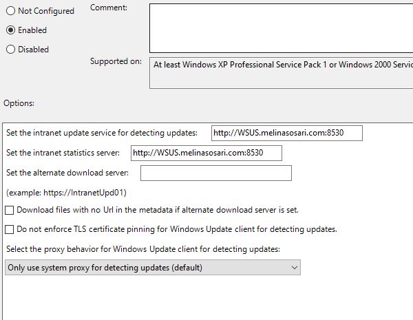
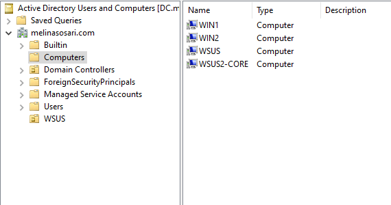
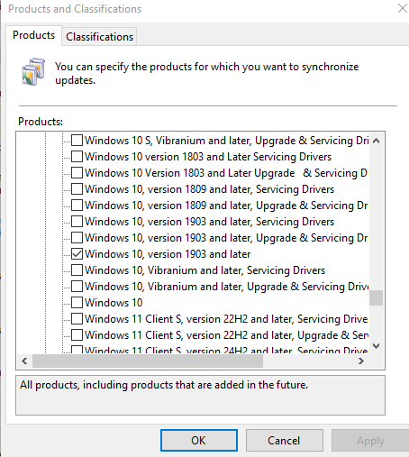
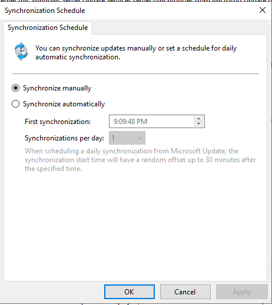
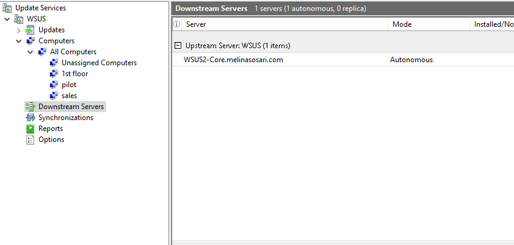
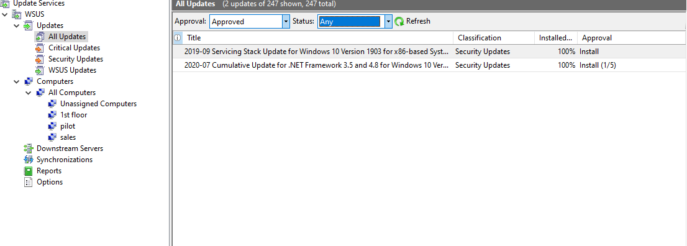
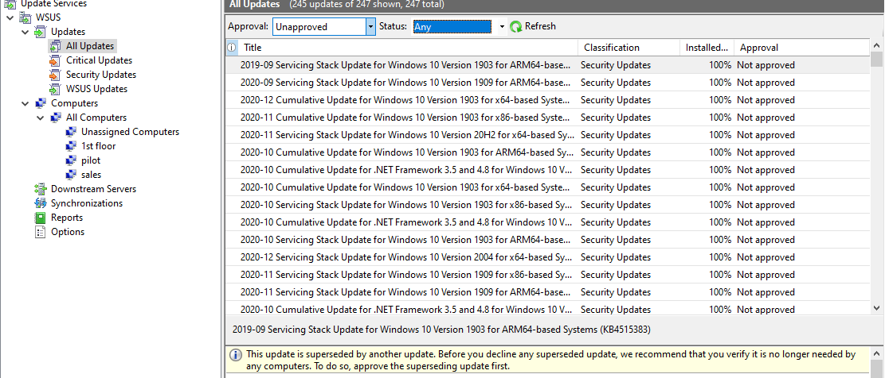
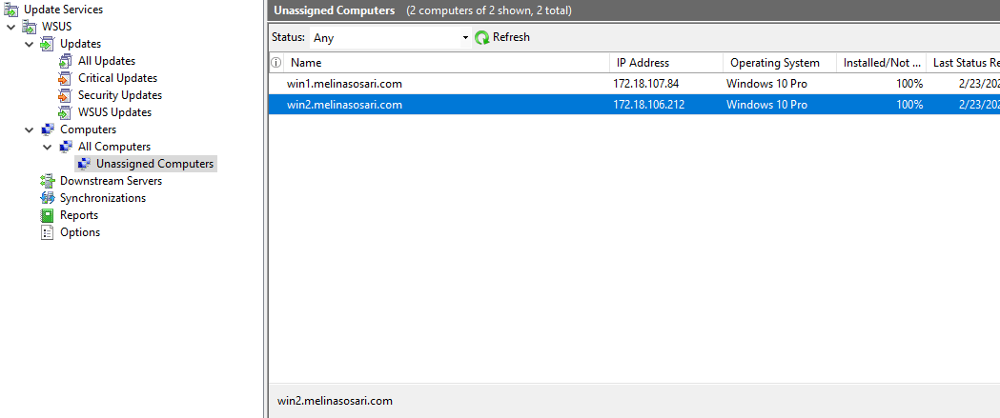

# WSUS Deployment with Downstream Autonomous Server (Windows Server 2022)

## Overview
This lab demonstrates the deployment of a Windows Server Update Server (WSUS) infrastructure in a domain environment using:

-Windows Server (Primary WSUS Server)

-Windows Server (Domain Controller)

-Windows Server Core (Downstream WSUS - Autonomous Mode)

-2 Windows 10 Clients

*All machines are joined to an Active Directory Domain.

## Lab Environment 

-Hypervisor: Microsoft Hyper-V

-WSUS Port: 8530(HTTP)

-Clients configured via Domain Group Policy

## Design

### Primary WSUS Server

-Installed on Windows Server 2022 (Desktop Experience)

-Configured for:

   -Products & Classification
   
   -Synchronization manually 
   
   -Update Approvals
   
   
### Downstream WSUS (Server Core)

-Installed on Windows Server Core

-Configured as **Autonomous Downstream Server** 

-Synchronizes updates from Primary WSUS

-Managed remotely through WSUS Console installed on Desktop Experience Server 

### Domain Controller

-Manages Active Directory

-Applies Group Policy to clinets for WSUS Configuration 

### Windows 10 Clients

-Joined to Domain

-Receive WSUS configuration via Group Policy 

-Download Updates from Primary WSUS Server

## Group Policy Configuration

Clinets are configured through Domain Group Policy:

Computer Configuration -> Administrative templates -> Windows Components -> Windows Update 

Enabled settings:

**Specify Intranet Microsoft Update Servive Location**:

WSUS Server: http://WSUS-Server.Domain-Name.com:8530 

## Clients in Domain

## WSUS Products & Classification

## Sync Schedule 

## Downstream WSUS 

## Approved vs Unapproved Updates

## Connected Clients 

## Result 
A functional WSUS infrastrucuture with autonomous downstream and client updates successfully configured.

